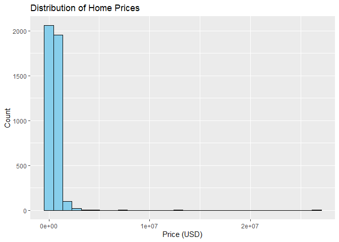
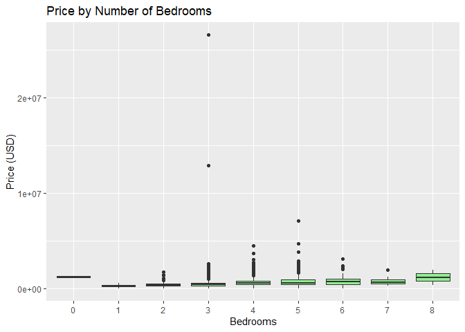
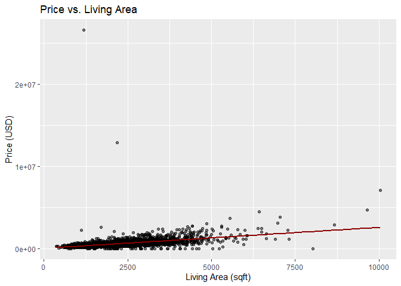

Getting Into Business
================
<center>  
<strong>Cole Moore</strong>  
</center>
<center>  
February 26, 2025  
</center>

### **Dataset Overview**

**<strong>When was the data collected?</strong>**

The data was collected in **2014**, with a time range from **May 2,
2014, to July 10, 2014**. It was uploaded to Kaggle and last updated
**seven months ago**.

------------------------------------------------------------------------

**<strong>Where was the data acquired?</strong>**

The data was acquired from **[Kaggle](https://www.kaggle.com)**. The
original source was **[Zillow](https://www.zillow.com)**, a real estate
website known for its housing market data.

------------------------------------------------------------------------

**<strong>How was the data acquired?</strong>**

Zillow’s **Economic Research Team** gathers, refines, and publishes
housing and economic data from both **public and proprietary sources**.
The core of Zillow’s data comes from:

- **Public property records** (deeds, parcel information, transaction
  history).  
- **Internal Zillow market analyses** using proprietary algorithms.  
- **Government and private housing reports** for contextual insights.

These sources are used to calculate various housing metrics, explained
in the next section.

------------------------------------------------------------------------

### **Dataset Attributes**

**<strong>What are the attributes of this dataset?</strong>**

The dataset consists of **18 attributes** that describe various
characteristics of properties:

- **Date:** The date the property was sold.  
- **Price:** The sale price of the property in USD, serving as the
  target variable in housing market analyses.  
- **Bedroom:** The total number of bedrooms in the property, indicating
  the home’s capacity.  
- **Bathroom:** The total number of bathrooms in the property, including
  full and half-baths.  
- **Sqft_living:** The total interior square footage of the home,
  representing the livable space.  
- **Sqft_lot:** The total land area of the property, including the house
  and yard.  
- **Floors:** The number of floors in the home, influencing the layout
  and design.  
- **Waterfront:** A binary variable indicating whether the property is
  located on the waterfront (1 = Yes, 0 = No).  
- **View:** An index ranging from **0 to 4**, where higher values
  indicate a better quality view from the property.  
- **Condition:** An index ranging from **1 to 5**, where **1**
  represents poor condition and **5** represents excellent condition.  
- **Sqft Above:** The total square footage of the home **excluding** the
  basement, reflecting the main living area.  
- **Sqft Basement:** The total square footage of the basement area,
  which may or may not be finished living space.  
- **Yr Built:** The year in which the property was originally
  constructed.  
- **Yr Renovated:** The most recent year in which the property underwent
  major renovations or updates.  
- **Street:** The street address of the property.  
- **City:** The city where the property is located.  
- **Statezip:** A combined variable containing both the **state** and
  **zip code** of the property.  
- **Country:** The country where the property is located.

------------------------------------------------------------------------

### **Data Types**

**<strong>What type of data do these attributes contain?</strong>**

| **Data Type** | **Attributes**                                                                     |
|---------------|------------------------------------------------------------------------------------|
| **Nominal**   | Street, City, Statezip, Country, Waterfront                                        |
| **Ordinal**   | View, Condition                                                                    |
| **Interval**  | Yr Built, Yr Renovated                                                             |
| **Ratio**     | Price, Bedroom, Bathroom, Sqft_living, Sqft_lot, Floors, Sqft Above, Sqft Basement |

- **Nominal:** Categorical variables without a meaningful order, such as
  property location attributes.  
- **Ordinal:** Ranked variables with a meaningful order but uneven
  intervals, such as **View** and **Condition** ratings.  
- **Interval:** Numeric variables with meaningful differences but no
  true zero, such as **Yr Built** and **Yr Renovated**.  
- **Ratio:** Continuous numerical attributes with a true zero, such as
  **Price**, **Sqft_living**, and **Sqft_lot**.

``` r
library(knitr)
```

    ## Warning: package 'knitr' was built under R version 4.3.3

``` r
library(kableExtra)
```

    ## Warning: package 'kableExtra' was built under R version 4.3.3

    ## 
    ## Attaching package: 'kableExtra'

    ## The following object is masked from 'package:dplyr':
    ## 
    ##     group_rows

``` r
library(ggplot2)


# Create a table for dataset attributes
attributes_table <- data.frame(
  Attribute = c("Date", "Price", "Bedroom", "Bathroom", "Sqft_living", "Sqft_lot", "Floors", "Waterfront",
                "View", "Condition", "Sqft Above", "Sqft Basement", "Yr Built", "Yr Renovated", "Street", "City",
                "Statezip", "Country"),
  Description = c("Date the property was sold",
                  "Sale price of the property in USD (target variable)",
                  "Number of bedrooms in the property",
                  "Number of bathrooms in the property (full and half-baths)",
                  "Total interior square footage of the home",
                  "Total land area of the property, including the house and yard",
                  "Number of floors in the home",
                  "Binary indicator for waterfront location (1 = Yes, 0 = No)",
                  "Index (0-4) rating the quality of the property's view",
                  "Index (1-5) rating the condition of the property",
                  "Total square footage of the home excluding the basement",
                  "Total square footage of the basement area",
                  "Year the property was originally constructed",
                  "Year of the most recent renovation",
                  "Street address of the property",
                  "City where the property is located",
                  "State and ZIP code of the property",
                  "Country where the property is located"),
  DataType = c("Date", "Ratio", "Ratio", "Ratio", "Ratio", "Ratio", "Ratio", "Nominal",
               "Ordinal", "Ordinal", "Ratio", "Ratio", "Interval", "Interval", "Nominal", "Nominal",
               "Nominal", "Nominal")
)

# Format and display the table
kable(attributes_table, caption = "Dataset Attributes and Descriptions") %>%
  kable_styling(bootstrap_options = c("striped", "hover", "condensed"), full_width = TRUE) %>%
  column_spec(1, bold = TRUE, width = "15%") %>%
  column_spec(2, italic = TRUE, width = "65%") %>%
  column_spec(3, width = "20%") %>%
  row_spec(0, background = "lightgray")
```

<table class="table table-striped table-hover table-condensed" style="margin-left: auto; margin-right: auto;">
<caption>
Dataset Attributes and Descriptions
</caption>
<thead>
<tr>
<th style="text-align:left;background-color: lightgray !important;">
Attribute
</th>
<th style="text-align:left;background-color: lightgray !important;">
Description
</th>
<th style="text-align:left;background-color: lightgray !important;">
DataType
</th>
</tr>
</thead>
<tbody>
<tr>
<td style="text-align:left;width: 15%; font-weight: bold;">
Date
</td>
<td style="text-align:left;width: 65%; font-style: italic;">
Date the property was sold
</td>
<td style="text-align:left;width: 20%; ">
Date
</td>
</tr>
<tr>
<td style="text-align:left;width: 15%; font-weight: bold;">
Price
</td>
<td style="text-align:left;width: 65%; font-style: italic;">
Sale price of the property in USD (target variable)
</td>
<td style="text-align:left;width: 20%; ">
Ratio
</td>
</tr>
<tr>
<td style="text-align:left;width: 15%; font-weight: bold;">
Bedroom
</td>
<td style="text-align:left;width: 65%; font-style: italic;">
Number of bedrooms in the property
</td>
<td style="text-align:left;width: 20%; ">
Ratio
</td>
</tr>
<tr>
<td style="text-align:left;width: 15%; font-weight: bold;">
Bathroom
</td>
<td style="text-align:left;width: 65%; font-style: italic;">
Number of bathrooms in the property (full and half-baths)
</td>
<td style="text-align:left;width: 20%; ">
Ratio
</td>
</tr>
<tr>
<td style="text-align:left;width: 15%; font-weight: bold;">
Sqft_living
</td>
<td style="text-align:left;width: 65%; font-style: italic;">
Total interior square footage of the home
</td>
<td style="text-align:left;width: 20%; ">
Ratio
</td>
</tr>
<tr>
<td style="text-align:left;width: 15%; font-weight: bold;">
Sqft_lot
</td>
<td style="text-align:left;width: 65%; font-style: italic;">
Total land area of the property, including the house and yard
</td>
<td style="text-align:left;width: 20%; ">
Ratio
</td>
</tr>
<tr>
<td style="text-align:left;width: 15%; font-weight: bold;">
Floors
</td>
<td style="text-align:left;width: 65%; font-style: italic;">
Number of floors in the home
</td>
<td style="text-align:left;width: 20%; ">
Ratio
</td>
</tr>
<tr>
<td style="text-align:left;width: 15%; font-weight: bold;">
Waterfront
</td>
<td style="text-align:left;width: 65%; font-style: italic;">
Binary indicator for waterfront location (1 = Yes, 0 = No)
</td>
<td style="text-align:left;width: 20%; ">
Nominal
</td>
</tr>
<tr>
<td style="text-align:left;width: 15%; font-weight: bold;">
View
</td>
<td style="text-align:left;width: 65%; font-style: italic;">
Index (0-4) rating the quality of the property’s view
</td>
<td style="text-align:left;width: 20%; ">
Ordinal
</td>
</tr>
<tr>
<td style="text-align:left;width: 15%; font-weight: bold;">
Condition
</td>
<td style="text-align:left;width: 65%; font-style: italic;">
Index (1-5) rating the condition of the property
</td>
<td style="text-align:left;width: 20%; ">
Ordinal
</td>
</tr>
<tr>
<td style="text-align:left;width: 15%; font-weight: bold;">
Sqft Above
</td>
<td style="text-align:left;width: 65%; font-style: italic;">
Total square footage of the home excluding the basement
</td>
<td style="text-align:left;width: 20%; ">
Ratio
</td>
</tr>
<tr>
<td style="text-align:left;width: 15%; font-weight: bold;">
Sqft Basement
</td>
<td style="text-align:left;width: 65%; font-style: italic;">
Total square footage of the basement area
</td>
<td style="text-align:left;width: 20%; ">
Ratio
</td>
</tr>
<tr>
<td style="text-align:left;width: 15%; font-weight: bold;">
Yr Built
</td>
<td style="text-align:left;width: 65%; font-style: italic;">
Year the property was originally constructed
</td>
<td style="text-align:left;width: 20%; ">
Interval
</td>
</tr>
<tr>
<td style="text-align:left;width: 15%; font-weight: bold;">
Yr Renovated
</td>
<td style="text-align:left;width: 65%; font-style: italic;">
Year of the most recent renovation
</td>
<td style="text-align:left;width: 20%; ">
Interval
</td>
</tr>
<tr>
<td style="text-align:left;width: 15%; font-weight: bold;">
Street
</td>
<td style="text-align:left;width: 65%; font-style: italic;">
Street address of the property
</td>
<td style="text-align:left;width: 20%; ">
Nominal
</td>
</tr>
<tr>
<td style="text-align:left;width: 15%; font-weight: bold;">
City
</td>
<td style="text-align:left;width: 65%; font-style: italic;">
City where the property is located
</td>
<td style="text-align:left;width: 20%; ">
Nominal
</td>
</tr>
<tr>
<td style="text-align:left;width: 15%; font-weight: bold;">
Statezip
</td>
<td style="text-align:left;width: 65%; font-style: italic;">
State and ZIP code of the property
</td>
<td style="text-align:left;width: 20%; ">
Nominal
</td>
</tr>
<tr>
<td style="text-align:left;width: 15%; font-weight: bold;">
Country
</td>
<td style="text-align:left;width: 65%; font-style: italic;">
Country where the property is located
</td>
<td style="text-align:left;width: 20%; ">
Nominal
</td>
</tr>
</tbody>
</table>

``` r
# Load necessary libraries
library(dplyr)
library(readr)
```

    ## Warning: package 'readr' was built under R version 4.3.3

``` r
library(knitr)
library(kableExtra)
library(ggplot2)


# Load the dataset (make sure the CSV is in your working directory or adjust the path)
df <- read_csv("USA Housing Dataset.csv")
```

    ## Rows: 4140 Columns: 18
    ## ── Column specification ───────────────────────────────────────────────────────────────────────────────────────────────────────────
    ## Delimiter: ","
    ## chr   (4): street, city, statezip, country
    ## dbl  (13): price, bedrooms, bathrooms, sqft_living, sqft_lot, floors, waterfront, view, condition, sqft_above, sqft_basement, y...
    ## dttm  (1): date
    ## 
    ## ℹ Use `spec()` to retrieve the full column specification for this data.
    ## ℹ Specify the column types or set `show_col_types = FALSE` to quiet this message.

``` r
# Select numeric columns
numeric_df <- df %>%
  select(where(is.numeric))

# Generate summary statistics
numeric_summary <- data.frame(
  Variable = names(numeric_df),
  Count = sapply(numeric_df, function(x) sum(!is.na(x))),
  Mean = sapply(numeric_df, mean, na.rm = TRUE),
  SD = sapply(numeric_df, sd, na.rm = TRUE),
  Min = sapply(numeric_df, min, na.rm = TRUE),
  Q1 = sapply(numeric_df, quantile, probs = 0.25, na.rm = TRUE),
  Median = sapply(numeric_df, median, na.rm = TRUE),
  Q3 = sapply(numeric_df, quantile, probs = 0.75, na.rm = TRUE),
  Max = sapply(numeric_df, max, na.rm = TRUE)
)

# Display as a formatted table using kable
kable(numeric_summary, digits = 2, caption = "Summary Statistics - Numeric Variables") %>%
  kable_styling(full_width = TRUE, bootstrap_options = c("striped", "hover")) %>%
  column_spec(1, bold = TRUE)
```

<table class="table table-striped table-hover" style="margin-left: auto; margin-right: auto;">
<caption>
Summary Statistics - Numeric Variables
</caption>
<thead>
<tr>
<th style="text-align:left;">
</th>
<th style="text-align:left;">
Variable
</th>
<th style="text-align:right;">
Count
</th>
<th style="text-align:right;">
Mean
</th>
<th style="text-align:right;">
SD
</th>
<th style="text-align:right;">
Min
</th>
<th style="text-align:right;">
Q1
</th>
<th style="text-align:right;">
Median
</th>
<th style="text-align:right;">
Q3
</th>
<th style="text-align:right;">
Max
</th>
</tr>
</thead>
<tbody>
<tr>
<td style="text-align:left;font-weight: bold;">
price
</td>
<td style="text-align:left;">
price
</td>
<td style="text-align:right;">
4140
</td>
<td style="text-align:right;">
553062.88
</td>
<td style="text-align:right;">
583686.45
</td>
<td style="text-align:right;">
0
</td>
<td style="text-align:right;">
320000.00
</td>
<td style="text-align:right;">
460000.00
</td>
<td style="text-align:right;">
659125.0
</td>
<td style="text-align:right;">
26590000.00
</td>
</tr>
<tr>
<td style="text-align:left;font-weight: bold;">
bedrooms
</td>
<td style="text-align:left;">
bedrooms
</td>
<td style="text-align:right;">
4140
</td>
<td style="text-align:right;">
3.40
</td>
<td style="text-align:right;">
0.90
</td>
<td style="text-align:right;">
0
</td>
<td style="text-align:right;">
3.00
</td>
<td style="text-align:right;">
3.00
</td>
<td style="text-align:right;">
4.0
</td>
<td style="text-align:right;">
8.00
</td>
</tr>
<tr>
<td style="text-align:left;font-weight: bold;">
bathrooms
</td>
<td style="text-align:left;">
bathrooms
</td>
<td style="text-align:right;">
4140
</td>
<td style="text-align:right;">
2.16
</td>
<td style="text-align:right;">
0.78
</td>
<td style="text-align:right;">
0
</td>
<td style="text-align:right;">
1.75
</td>
<td style="text-align:right;">
2.25
</td>
<td style="text-align:right;">
2.5
</td>
<td style="text-align:right;">
6.75
</td>
</tr>
<tr>
<td style="text-align:left;font-weight: bold;">
sqft_living
</td>
<td style="text-align:left;">
sqft_living
</td>
<td style="text-align:right;">
4140
</td>
<td style="text-align:right;">
2143.64
</td>
<td style="text-align:right;">
957.48
</td>
<td style="text-align:right;">
370
</td>
<td style="text-align:right;">
1470.00
</td>
<td style="text-align:right;">
1980.00
</td>
<td style="text-align:right;">
2620.0
</td>
<td style="text-align:right;">
10040.00
</td>
</tr>
<tr>
<td style="text-align:left;font-weight: bold;">
sqft_lot
</td>
<td style="text-align:left;">
sqft_lot
</td>
<td style="text-align:right;">
4140
</td>
<td style="text-align:right;">
14697.64
</td>
<td style="text-align:right;">
35876.84
</td>
<td style="text-align:right;">
638
</td>
<td style="text-align:right;">
5000.00
</td>
<td style="text-align:right;">
7676.00
</td>
<td style="text-align:right;">
11000.0
</td>
<td style="text-align:right;">
1074218.00
</td>
</tr>
<tr>
<td style="text-align:left;font-weight: bold;">
floors
</td>
<td style="text-align:left;">
floors
</td>
<td style="text-align:right;">
4140
</td>
<td style="text-align:right;">
1.51
</td>
<td style="text-align:right;">
0.53
</td>
<td style="text-align:right;">
1
</td>
<td style="text-align:right;">
1.00
</td>
<td style="text-align:right;">
1.50
</td>
<td style="text-align:right;">
2.0
</td>
<td style="text-align:right;">
3.50
</td>
</tr>
<tr>
<td style="text-align:left;font-weight: bold;">
waterfront
</td>
<td style="text-align:left;">
waterfront
</td>
<td style="text-align:right;">
4140
</td>
<td style="text-align:right;">
0.01
</td>
<td style="text-align:right;">
0.09
</td>
<td style="text-align:right;">
0
</td>
<td style="text-align:right;">
0.00
</td>
<td style="text-align:right;">
0.00
</td>
<td style="text-align:right;">
0.0
</td>
<td style="text-align:right;">
1.00
</td>
</tr>
<tr>
<td style="text-align:left;font-weight: bold;">
view
</td>
<td style="text-align:left;">
view
</td>
<td style="text-align:right;">
4140
</td>
<td style="text-align:right;">
0.25
</td>
<td style="text-align:right;">
0.79
</td>
<td style="text-align:right;">
0
</td>
<td style="text-align:right;">
0.00
</td>
<td style="text-align:right;">
0.00
</td>
<td style="text-align:right;">
0.0
</td>
<td style="text-align:right;">
4.00
</td>
</tr>
<tr>
<td style="text-align:left;font-weight: bold;">
condition
</td>
<td style="text-align:left;">
condition
</td>
<td style="text-align:right;">
4140
</td>
<td style="text-align:right;">
3.45
</td>
<td style="text-align:right;">
0.68
</td>
<td style="text-align:right;">
1
</td>
<td style="text-align:right;">
3.00
</td>
<td style="text-align:right;">
3.00
</td>
<td style="text-align:right;">
4.0
</td>
<td style="text-align:right;">
5.00
</td>
</tr>
<tr>
<td style="text-align:left;font-weight: bold;">
sqft_above
</td>
<td style="text-align:left;">
sqft_above
</td>
<td style="text-align:right;">
4140
</td>
<td style="text-align:right;">
1831.35
</td>
<td style="text-align:right;">
861.38
</td>
<td style="text-align:right;">
370
</td>
<td style="text-align:right;">
1190.00
</td>
<td style="text-align:right;">
1600.00
</td>
<td style="text-align:right;">
2310.0
</td>
<td style="text-align:right;">
8020.00
</td>
</tr>
<tr>
<td style="text-align:left;font-weight: bold;">
sqft_basement
</td>
<td style="text-align:left;">
sqft_basement
</td>
<td style="text-align:right;">
4140
</td>
<td style="text-align:right;">
312.29
</td>
<td style="text-align:right;">
464.35
</td>
<td style="text-align:right;">
0
</td>
<td style="text-align:right;">
0.00
</td>
<td style="text-align:right;">
0.00
</td>
<td style="text-align:right;">
602.5
</td>
<td style="text-align:right;">
4820.00
</td>
</tr>
<tr>
<td style="text-align:left;font-weight: bold;">
yr_built
</td>
<td style="text-align:left;">
yr_built
</td>
<td style="text-align:right;">
4140
</td>
<td style="text-align:right;">
1970.81
</td>
<td style="text-align:right;">
29.81
</td>
<td style="text-align:right;">
1900
</td>
<td style="text-align:right;">
1951.00
</td>
<td style="text-align:right;">
1976.00
</td>
<td style="text-align:right;">
1997.0
</td>
<td style="text-align:right;">
2014.00
</td>
</tr>
<tr>
<td style="text-align:left;font-weight: bold;">
yr_renovated
</td>
<td style="text-align:left;">
yr_renovated
</td>
<td style="text-align:right;">
4140
</td>
<td style="text-align:right;">
808.37
</td>
<td style="text-align:right;">
979.38
</td>
<td style="text-align:right;">
0
</td>
<td style="text-align:right;">
0.00
</td>
<td style="text-align:right;">
0.00
</td>
<td style="text-align:right;">
1999.0
</td>
<td style="text-align:right;">
2014.00
</td>
</tr>
</tbody>
</table>

------------------------------------------------------------------------

### **Missing and Empty Values**

In this section, we examine whether the dataset contains any missing
(`NA`) or empty (`""`) values and discuss how to handle them
appropriately.

``` r
# Count missing or empty values in each column
# Identify missing (NA) values for all columns
missing_na <- sapply(df, function(x) sum(is.na(x)))

# Identify empty strings only for character columns
missing_empty <- sapply(df, function(x) {
  if (is.character(x)) sum(x == "")
  else 0
})

# Combine results
na_summary <- data.frame(
  Variable = names(df),
  Missing_Values = missing_na + missing_empty
)

# Display formatted table
kable(na_summary, caption = "Missing or Empty Values by Variable") %>%
  kable_styling(full_width = TRUE, bootstrap_options = c("striped", "hover")) %>%
  column_spec(1, bold = TRUE)
```

<table class="table table-striped table-hover" style="margin-left: auto; margin-right: auto;">
<caption>
Missing or Empty Values by Variable
</caption>
<thead>
<tr>
<th style="text-align:left;">
</th>
<th style="text-align:left;">
Variable
</th>
<th style="text-align:right;">
Missing_Values
</th>
</tr>
</thead>
<tbody>
<tr>
<td style="text-align:left;font-weight: bold;">
date
</td>
<td style="text-align:left;">
date
</td>
<td style="text-align:right;">
0
</td>
</tr>
<tr>
<td style="text-align:left;font-weight: bold;">
price
</td>
<td style="text-align:left;">
price
</td>
<td style="text-align:right;">
0
</td>
</tr>
<tr>
<td style="text-align:left;font-weight: bold;">
bedrooms
</td>
<td style="text-align:left;">
bedrooms
</td>
<td style="text-align:right;">
0
</td>
</tr>
<tr>
<td style="text-align:left;font-weight: bold;">
bathrooms
</td>
<td style="text-align:left;">
bathrooms
</td>
<td style="text-align:right;">
0
</td>
</tr>
<tr>
<td style="text-align:left;font-weight: bold;">
sqft_living
</td>
<td style="text-align:left;">
sqft_living
</td>
<td style="text-align:right;">
0
</td>
</tr>
<tr>
<td style="text-align:left;font-weight: bold;">
sqft_lot
</td>
<td style="text-align:left;">
sqft_lot
</td>
<td style="text-align:right;">
0
</td>
</tr>
<tr>
<td style="text-align:left;font-weight: bold;">
floors
</td>
<td style="text-align:left;">
floors
</td>
<td style="text-align:right;">
0
</td>
</tr>
<tr>
<td style="text-align:left;font-weight: bold;">
waterfront
</td>
<td style="text-align:left;">
waterfront
</td>
<td style="text-align:right;">
0
</td>
</tr>
<tr>
<td style="text-align:left;font-weight: bold;">
view
</td>
<td style="text-align:left;">
view
</td>
<td style="text-align:right;">
0
</td>
</tr>
<tr>
<td style="text-align:left;font-weight: bold;">
condition
</td>
<td style="text-align:left;">
condition
</td>
<td style="text-align:right;">
0
</td>
</tr>
<tr>
<td style="text-align:left;font-weight: bold;">
sqft_above
</td>
<td style="text-align:left;">
sqft_above
</td>
<td style="text-align:right;">
0
</td>
</tr>
<tr>
<td style="text-align:left;font-weight: bold;">
sqft_basement
</td>
<td style="text-align:left;">
sqft_basement
</td>
<td style="text-align:right;">
0
</td>
</tr>
<tr>
<td style="text-align:left;font-weight: bold;">
yr_built
</td>
<td style="text-align:left;">
yr_built
</td>
<td style="text-align:right;">
0
</td>
</tr>
<tr>
<td style="text-align:left;font-weight: bold;">
yr_renovated
</td>
<td style="text-align:left;">
yr_renovated
</td>
<td style="text-align:right;">
0
</td>
</tr>
<tr>
<td style="text-align:left;font-weight: bold;">
street
</td>
<td style="text-align:left;">
street
</td>
<td style="text-align:right;">
0
</td>
</tr>
<tr>
<td style="text-align:left;font-weight: bold;">
city
</td>
<td style="text-align:left;">
city
</td>
<td style="text-align:right;">
0
</td>
</tr>
<tr>
<td style="text-align:left;font-weight: bold;">
statezip
</td>
<td style="text-align:left;">
statezip
</td>
<td style="text-align:right;">
0
</td>
</tr>
<tr>
<td style="text-align:left;font-weight: bold;">
country
</td>
<td style="text-align:left;">
country
</td>
<td style="text-align:right;">
0
</td>
</tr>
</tbody>
</table>

``` r
na_summary <- data.frame(Variable = names(na_summary), Missing_Values = na_summary)

# Display as formatted table
kable(na_summary, caption = "Missing or Empty Values by Variable") %>%
  kable_styling(full_width = TRUE, bootstrap_options = c("striped", "hover")) %>%
  column_spec(1, bold = TRUE)
```

<table class="table table-striped table-hover" style="margin-left: auto; margin-right: auto;">
<caption>
Missing or Empty Values by Variable
</caption>
<thead>
<tr>
<th style="text-align:left;">
</th>
<th style="text-align:left;">
Variable
</th>
<th style="text-align:left;">
Missing_Values.Variable
</th>
<th style="text-align:right;">
Missing_Values.Missing_Values
</th>
</tr>
</thead>
<tbody>
<tr>
<td style="text-align:left;font-weight: bold;">
date
</td>
<td style="text-align:left;">
Variable
</td>
<td style="text-align:left;">
date
</td>
<td style="text-align:right;">
0
</td>
</tr>
<tr>
<td style="text-align:left;font-weight: bold;">
price
</td>
<td style="text-align:left;">
Missing_Values
</td>
<td style="text-align:left;">
price
</td>
<td style="text-align:right;">
0
</td>
</tr>
<tr>
<td style="text-align:left;font-weight: bold;">
bedrooms
</td>
<td style="text-align:left;">
Variable
</td>
<td style="text-align:left;">
bedrooms
</td>
<td style="text-align:right;">
0
</td>
</tr>
<tr>
<td style="text-align:left;font-weight: bold;">
bathrooms
</td>
<td style="text-align:left;">
Missing_Values
</td>
<td style="text-align:left;">
bathrooms
</td>
<td style="text-align:right;">
0
</td>
</tr>
<tr>
<td style="text-align:left;font-weight: bold;">
sqft_living
</td>
<td style="text-align:left;">
Variable
</td>
<td style="text-align:left;">
sqft_living
</td>
<td style="text-align:right;">
0
</td>
</tr>
<tr>
<td style="text-align:left;font-weight: bold;">
sqft_lot
</td>
<td style="text-align:left;">
Missing_Values
</td>
<td style="text-align:left;">
sqft_lot
</td>
<td style="text-align:right;">
0
</td>
</tr>
<tr>
<td style="text-align:left;font-weight: bold;">
floors
</td>
<td style="text-align:left;">
Variable
</td>
<td style="text-align:left;">
floors
</td>
<td style="text-align:right;">
0
</td>
</tr>
<tr>
<td style="text-align:left;font-weight: bold;">
waterfront
</td>
<td style="text-align:left;">
Missing_Values
</td>
<td style="text-align:left;">
waterfront
</td>
<td style="text-align:right;">
0
</td>
</tr>
<tr>
<td style="text-align:left;font-weight: bold;">
view
</td>
<td style="text-align:left;">
Variable
</td>
<td style="text-align:left;">
view
</td>
<td style="text-align:right;">
0
</td>
</tr>
<tr>
<td style="text-align:left;font-weight: bold;">
condition
</td>
<td style="text-align:left;">
Missing_Values
</td>
<td style="text-align:left;">
condition
</td>
<td style="text-align:right;">
0
</td>
</tr>
<tr>
<td style="text-align:left;font-weight: bold;">
sqft_above
</td>
<td style="text-align:left;">
Variable
</td>
<td style="text-align:left;">
sqft_above
</td>
<td style="text-align:right;">
0
</td>
</tr>
<tr>
<td style="text-align:left;font-weight: bold;">
sqft_basement
</td>
<td style="text-align:left;">
Missing_Values
</td>
<td style="text-align:left;">
sqft_basement
</td>
<td style="text-align:right;">
0
</td>
</tr>
<tr>
<td style="text-align:left;font-weight: bold;">
yr_built
</td>
<td style="text-align:left;">
Variable
</td>
<td style="text-align:left;">
yr_built
</td>
<td style="text-align:right;">
0
</td>
</tr>
<tr>
<td style="text-align:left;font-weight: bold;">
yr_renovated
</td>
<td style="text-align:left;">
Missing_Values
</td>
<td style="text-align:left;">
yr_renovated
</td>
<td style="text-align:right;">
0
</td>
</tr>
<tr>
<td style="text-align:left;font-weight: bold;">
street
</td>
<td style="text-align:left;">
Variable
</td>
<td style="text-align:left;">
street
</td>
<td style="text-align:right;">
0
</td>
</tr>
<tr>
<td style="text-align:left;font-weight: bold;">
city
</td>
<td style="text-align:left;">
Missing_Values
</td>
<td style="text-align:left;">
city
</td>
<td style="text-align:right;">
0
</td>
</tr>
<tr>
<td style="text-align:left;font-weight: bold;">
statezip
</td>
<td style="text-align:left;">
Variable
</td>
<td style="text-align:left;">
statezip
</td>
<td style="text-align:right;">
0
</td>
</tr>
<tr>
<td style="text-align:left;font-weight: bold;">
country
</td>
<td style="text-align:left;">
Missing_Values
</td>
<td style="text-align:left;">
country
</td>
<td style="text-align:right;">
0
</td>
</tr>
</tbody>
</table>

------------------------------------------------------------------------

### **Exploratory Data Analysis**

#### What is the distribution of home prices in the dataset?

Understanding the distribution of home prices helps identify typical
price points and outliers — essential for evaluating affordability and
investment potential.

``` r
ggplot(df, aes(x = price)) +
  geom_histogram(fill = "skyblue", bins = 30, color = "black") +
  labs(title = "Distribution of Home Prices", x = "Price (USD)", y = "Count")
```

<!-- -->

\*\* Insight:\*\* Most homes are priced under \$600,000, with a clear
right-skewed distribution. This suggests a small subset of high-end
homes push the average upward.

#### How does the number of bedrooms affect home prices?

Bedrooms are a primary factor buyers consider. This plot explores
whether more bedrooms tend to increase a property’s market value.

``` r
ggplot(df, aes(x = factor(bedrooms), y = price)) +
  geom_boxplot(fill = "lightgreen") +
  labs(title = "Price by Number of Bedrooms", x = "Bedrooms", y = "Price (USD)")
```

<!-- -->

\*\* Insight:\*\* Homes with more bedrooms generally have higher prices,
but there’s substantial overlap. This suggests that other features (like
square footage or location) also significantly affect price.

#### Is there a relationship between square footage and price?

We hypothesize that larger homes command higher prices. Let’s visualize
the relationship between interior living space and price.

``` r
ggplot(df, aes(x = sqft_living, y = price)) +
  geom_point(alpha = 0.5) +
  geom_smooth(method = "lm", se = FALSE, color = "darkred") +
  labs(title = "Price vs. Living Area", x = "Living Area (sqft)", y = "Price (USD)")
```

    ## `geom_smooth()` using formula = 'y ~ x'

<!-- -->

\*\* Insight:\*\* There is a strong positive relationship between living
area and price. Larger homes tend to be worth more, though with
increasing variability at higher square footage levels.

------------------------------------------------------------------------

------------------------------------------------------------------------

### **3. Expanding Your Investment Knowledge**

While this dataset offers a great snapshot of property characteristics
and prices, supplementing it with additional data sources can provide
deeper insights and improve investment decisions.

#### Additional Dataset: Zillow Home Value Index (ZHVI)

- **Source:** [Zillow Research – ZHVI
  Data](https://www.zillow.com/research/data/)
- **Description:** The Zillow Home Value Index (ZHVI) tracks monthly
  median home values across regions, including ZIP codes, cities,
  counties, and metropolitan areas.

#### Why is this dataset useful?

- It provides time series data, allowing investors to analyze historical
  price trends and forecast future appreciation.
- It includes geographic variation, letting investors compare how
  property values change over time in different markets.

#### How does it complement your current data?

- The current dataset is cross-sectional (a snapshot in time), while the
  ZHVI adds a temporal dimension.
- By combining both, you could identify properties in regions that not
  only have good current value but also show strong long-term growth
  trends.
- It can help refine location-based investment decisions, guiding you
  toward markets with the best growth potential.

You can explore or download the ZHVI dataset here:  
**[Zillow Home Value Index
(ZHVI)](https://www.zillow.com/research/data/)**

------------------------------------------------------------------------

### **4. Communicating Your Findings**

This analysis helps make real estate investment more approachable by
exploring key features that influence home prices, such as square
footage, number of bedrooms, and location. We’ve also addressed data
quality by checking for missing values and visualized trends that affect
investment decisions.

Even without prior real estate or data experience, readers can now: -
Understand what attributes impact home value. - Identify how trends like
larger living space or better condition contribute to pricing. - See how
public datasets can be used to guide real-world investment strategy.

Our dataset gave us a snapshot of housing conditions across U.S. states.
By examining average prices and property features, and supplementing
with growth trend data (like Zillow’s ZHVI), investors can target areas
with both good current value and long-term appreciation potential.

------------------------------------------------------------------------

### **Reproducibility and Data Access**

The dataset used in this project is available on Kaggle:

**Data Link:**
<https://www.kaggle.com/datasets/fratzcan/usa-house-prices>

Since Kaggle requires login and sometimes API authentication, it’s
recommended to manually download the CSV and load it like this:

``` r
# Load CSV after manually downloading from Kaggle
df <- read_csv("USA Housing Dataset.csv")
```

    ## Rows: 4140 Columns: 18
    ## ── Column specification ───────────────────────────────────────────────────────────────────────────────────────────────────────────
    ## Delimiter: ","
    ## chr   (4): street, city, statezip, country
    ## dbl  (13): price, bedrooms, bathrooms, sqft_living, sqft_lot, floors, waterfront, view, condition, sqft_above, sqft_basement, y...
    ## dttm  (1): date
    ## 
    ## ℹ Use `spec()` to retrieve the full column specification for this data.
    ## ℹ Specify the column types or set `show_col_types = FALSE` to quiet this message.
